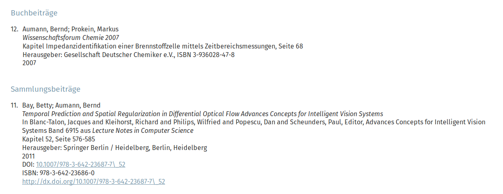
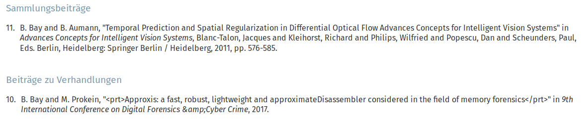

# Citestyles
Per default there are two different citestyles delivered with publications. Choose in the plugin which citestyle
you want to present.

## Default

Example default cite style:


## IEEE

Example IEE cite style:


## Add individual citestyles

Define some additional citestyles via page TSConfig:

```
tx_publications.flexForm.citestyle {
    100 = LLL:EXT:myext/Resources/Private/Language/locallang_db.xlf:flexform.pi1.template.citestyle.100
    101 = LLL:EXT:myext/Resources/Private/Language/locallang_db.xlf:flexform.pi1.template.citestyle.101
}
```

After that you have to define that your extension also keeps some partials for the extension - via TypoScript setup:

```
plugin.tx_publications {
    view {
        templateRootPaths.100 = EXT:myext/Resources/Private/Templates/Publications/
        partialRootPaths.100 = EXT:myext/Resources/Private/Partials/Publications/
        layoutRootPaths.100 = EXT:myext/Resources/Private/Layouts/Publications/
    }
}
```

And then you have to add the new partials in your extension
(simply copy an original partial and modify it to your needs):

```
<f:comment>
    File EXT:myext/Resources/Private/Partials/Publications/List/Citestyle/Citestyle100.html
</f:comment>

<div>
    <div>
        <f:render section="{publication.bibtype}" optional="1" arguments="{_all}" />
    </div>
</div>

<f:comment>One section per bibtype</f:comment>
<f:section name="article">
    <f:for each="{publication.authors}" as="author" iteration="iteration">
        {author.lastName},
    </f:for>
    
    <f:if condition="{publication.title}">
        <br/>
        <i>{publication.title}</i>
    </f:if>
    ...
</f:section>

```
