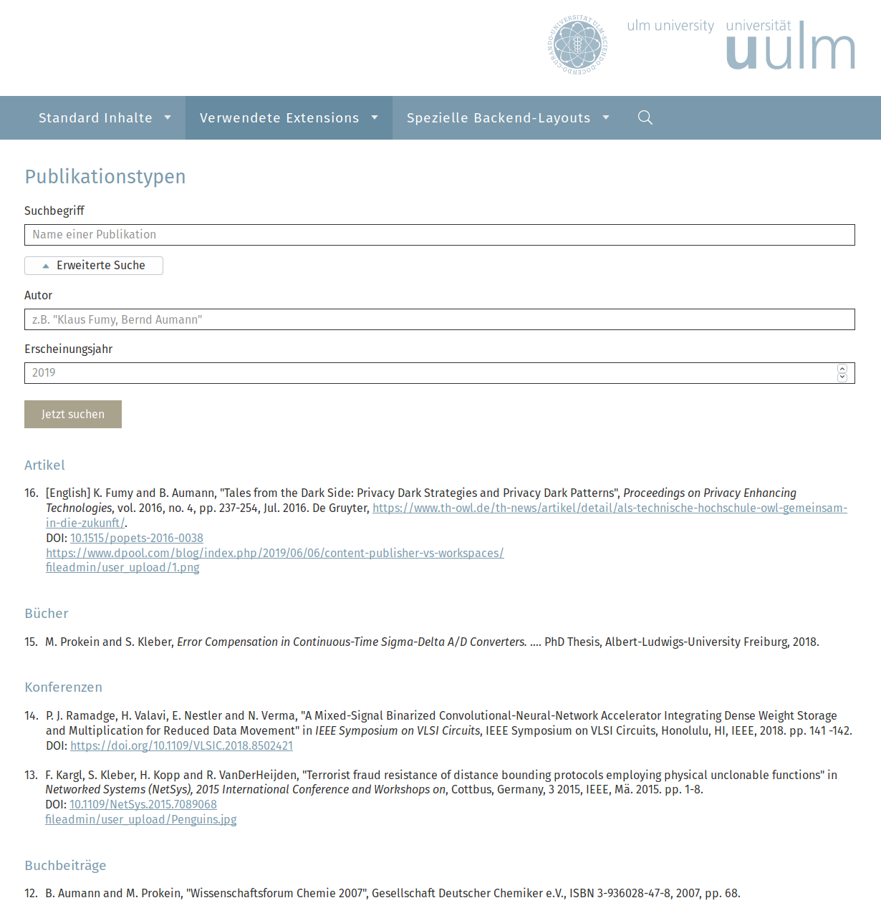
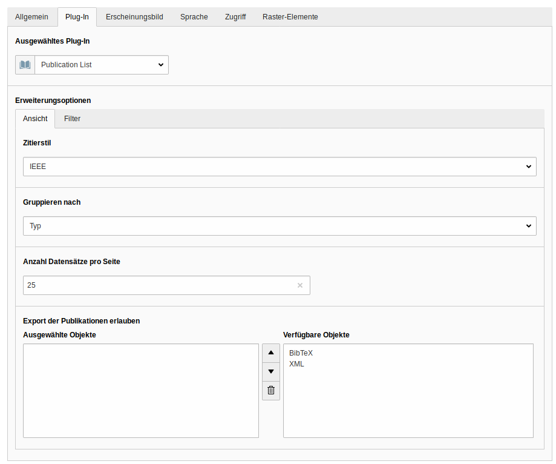

# publications is an TYPO3 extension to list academic publications

Inspired by the TYPO3 **bib** extension


## Introduction

Target group of this extension are universities and colleges:
Show academic publications in a listview with some filter possibilities in the plugin and in frontend.
Im- and export BibTeX or XML files (Import via Backend Module, Export in Frontend) to list publications.
Easily extend this extension with own importers or own citestyles. 

At the moment we support a default and the IEEE citestyle.


## Screenshots

Example list view:


Plugin:


Import module:


## Technical requirements

This extension needs minimum *TYPO3 9* or *TYPO3 10*
At the moment it's not possible to use publications without **composer mode**! Classic mode is not supported.


## Installation

* First of all, intall the extension via composer: `composer require in2code/publications`
* Clean caches
* Add the static TypoScript of the extension to your installation root template
* Add some publication and author records to a sysfolder
* Add the publication plugin to a default page 
* That's it


## Extending publications

* Look at the [importer documentation](Documentation/Importer.md) to see how you can add own importers
* Look at the [citestyle documentation](Documentation/Citestyles.md) to see how you can add your own cite styles


## Migration from bib

If you want to migrate records from extension bib to publications, there is a Command Controller for doing this

```
./vendor/bin/typo3cms publications:migrate
```

**Note:** If you want to delete all publications records before (to minimize uid conflicts), you can use

```
# Delete all records (truncate all tables)
./vendor/bin/typo3cms publications:clean 0

# Delete all records on page with uid 123
./vendor/bin/typo3cms publications:clean 123
```


## Changelog

| Version    | Date       | State      | Description                                                                                                        |
| ---------- | ---------- | ---------- | ------------------------------------------------------------------------------------------------------------------ |
| 3.0.0      | 2022-02-16 | Feature    | Highlighted Authors, Link names, Citestyles, Author model added. Support pmid field in migration.                  |
| 2.3.0      | 2021-03-19 | Feature    | Special character support for bib import, Fix generated icon tags                                                  |
| 2.2.0      | 2021-03-17 | Task       | Add auto deployment to TER, Add extension key in composer.json                                                     |
| 2.1.0      | 2020-12-03 | Feature    | Allow backend search for publications and authors                                                                  |
| 2.0.0      | 2020-11-25 | Task       | Support TYPO3 10 and drop support for 8, Space in IEEE between month and year now                                  |
| 1.17.0     | 2020-05-28 | Feature    | Add new citestyle APA                                                                                              |
| 1.16.0     | 2020-04-14 | Feature    | Add system fields (hidden, sys_language_uid, starttime, endtime)                                                   |
| 1.15.0     | 2020-04-09 | Feature    | Allow multiple record storage pages, add recursive storage page loading                                            |
| 1.14.0     | 2020-03-12 | Feature    | Use sections for data elements, Translate labels in standard citestyles                                            |
| 1.13.2     | 2019-03-11 | Bugfix     | Make composer.json compatible to composer 2.0                                                                      |
| 1.13.1     | 2019-03-11 | Bugfix     | Remove wrong whitespaces, fix translation keys                                                                     |
| 1.13.0     | 2019-12-11 | Feature    | Improve layout and add missing colons, render partial "LinkBlock" only if needed                                   |
| 1.12.0     | 2019-11-29 | Feature    | Make enumeration toggleble, bugfix with SQL mode strict and importers                                              |
| 1.11.0     | 2019-11-19 | Feature    | Make filter toggleble                                                                                              |
| 1.10.0     | 2019-11-19 | Feature    | Add additional section to some bibtypes                                                                            |
| 1.9.1      | 2019-11-19 | Bugfix     | Fix orderings bug                                                                                                  |
| 1.9.0      | 2019-10-29 | Feature    | Add localization for abstract label                                                                                |
| 1.8.0      | 2019-10-19 | Feature    | Adjust styling                                                                                                     |
| 1.7.0      | 2019-10-18 | Feature    | Add missing label                                                                                                  |
| 1.6.0      | 2019-10-18 | Feature    | Add abstract field in FE output                                                                                    |
| 1.5.0      | 2019-10-08 | Feature    | Add a sorting by date (if no date, take 1.1.currentyear)                                                           |
| 1.4.0      | 2019-10-07 | Feature    | Add new cite style (IEEE with abstract)                                                                            |
| 1.3.1      | 2019-09-10 | Bugfix     | Don't respect storage page in all repository functions                                                             |
| 1.3.0      | 2019-09-09 | Feature    | Allow multiple authors for filtering be+fe, Prefilter with extern/intern in plugin                                 |
| 1.2.0      | 2019-09-02 | Task       | Allow table wide exclude field definition, small change for title and bibtype tca                                  |
| 1.1.0      | 2019-08-29 | Task       | Fix issue with staticfilecache, use individual filter cookie per ce, year bugfix                                   |
| 1.0.1      | 2019-08-27 | Bugfix     | Fix some small typos                                                                                               |
| 1.0.0      | 2019-08-27 | Task       | First stable release                                                                                               |
| 0.4.0      | 2019-08-26 | Task       | 4. prerelease with documentation                                                                                   |
| 0.3.0      | 2019-08-26 | Task       | 3. prerelease with a finalized citestyles                                                                          |
| 0.2.0      | 2019-08-26 | Task       | 2. prerelease with a basic IEEE citestyle                                                                          |
| 0.1.0      | 2019-08-21 | Task       | First prerelease with a default citestyle only                                                                     |


## Patrons

* <a href="https://www.uni-ulm.de" target="_blank">University of Ulm</a> as the main sponsor of this extension
* <a href="https://www.in2code.de" target="_blank" title="Wir leben TYPO3">in2code GmbH</a> as the development partner of this extension


## Credits 

The icons 
* docx icon was made by <a href="https://www.flaticon.com/authors/freepik" title="Freepik">Freepik</a> 
* pdf icon was  made by <a href="https://www.flaticon.com/authors/smashicons" title="Smashicons">Smashicons</a>
